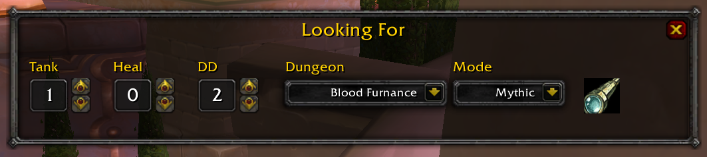
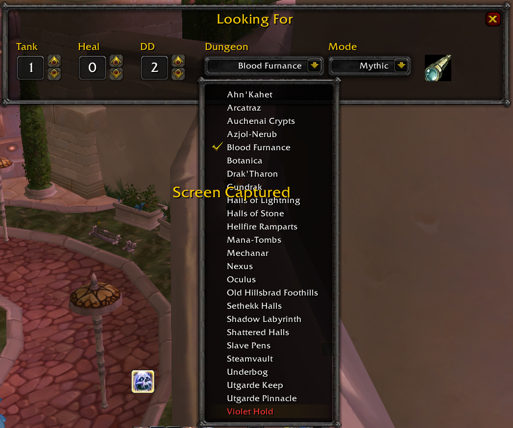
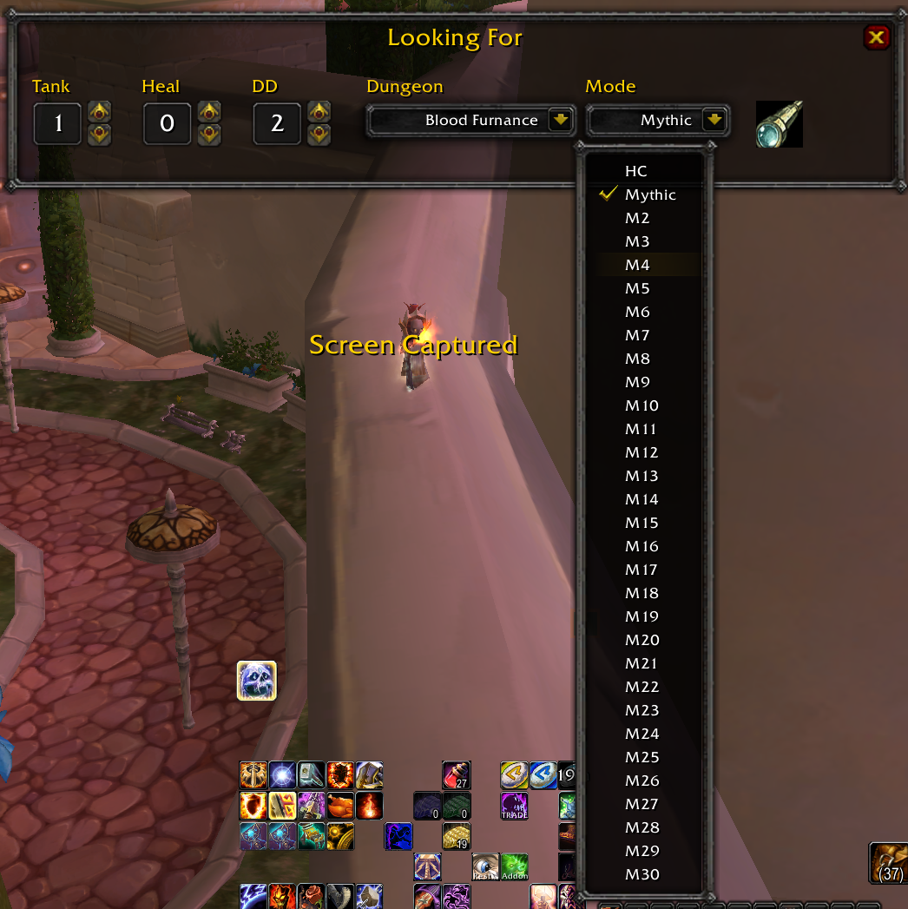

# LFM – Looking For Mythic/Man

**LFM** is a lightweight addon designed to make finding groups for **Mythic and Mythic+ dungeons** easier and more convenient.

LFM helps you quickly identify dungeons you have already completed or have an existing ID for.

## Features

* 🚫 **No More Manual LFM Messages**
  Stop typing repetitive messages like *"LF Tank"*, *"LF Heal"* or *"LF DPS"*. LFM makes finding the missing roles quick and effortless.

* 🆔 **Existing ID Overview**
  Clearly highlights dungeons for which you already have an existing instance ID, helping you avoid accidentally joining a group for a dungeon you cannot enter.

### Images

### How to Install

1. Download the addon by clicking the green **`<> Code`** button and selecting **Download ZIP**.
2. Extract the downloaded ZIP file.
3. Open the extracted folder.
4. Rename `LFM-main` to `LFM`.
5. Copy the `LFM` folder into your `Interface/Addons` folder.
6. Make sure the final folder structure looks like this:

   `Interface/Addons/LFM/`

   Inside the `LFM` folder, you should see files such as `LFM.lua`, `LFM.toc`, etc.

## ❤️ Support LFM

If you enjoy using LFM and would like to support its development, you can do so through GitHub Sponsors or PayPal.

- [💜 GitHub Sponsors](https://github.com/sponsors/Aberalgama)
- [💙 PayPal](https://paypal.me/svSalzmannViktor)

Every contribution is greatly appreciated and helps support further development of the addon!