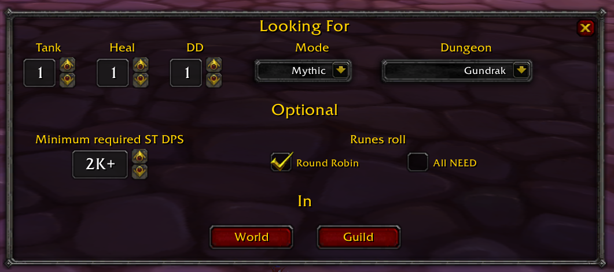
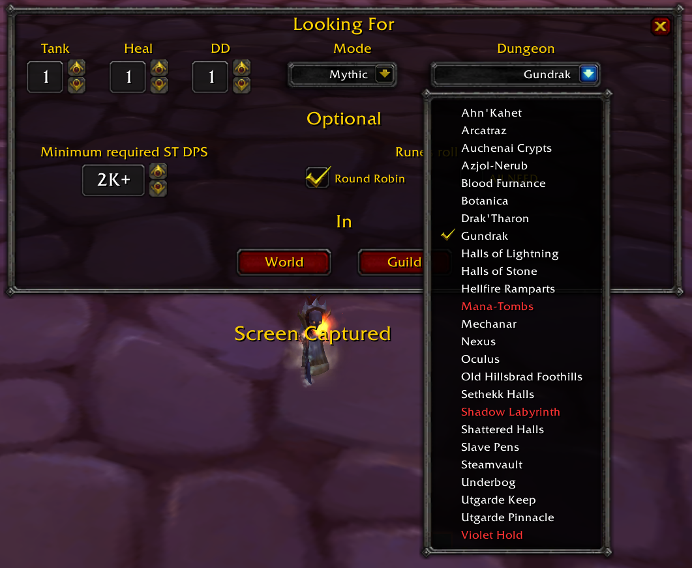
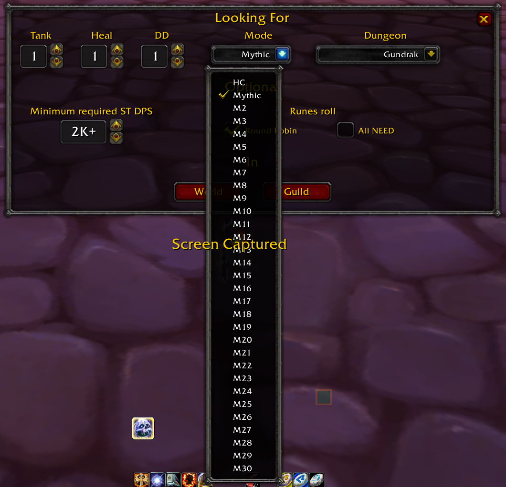

# LFM – Looking For Mythic/Member

**LFM** is a lightweight addon designed to make finding groups for **Mythic and Mythic+ dungeons** easier and more convenient.

LFM helps you quickly identify dungeons you have already completed or have an existing ID for, and automates posting group search messages.

## Features

* 🚫 **No More Manual LFM Messages**
  Stop typing repetitive messages like *"LF Tank"*, *"LF Heal"* or *"LF DPS"*. LFM formats and posts your search message directly to World or Guild chat channels with a single click.

* 🔴 **Saved ID / Lockout Identification (Red Text)**
  - LFM checks your character's active instance lockouts/IDs.
  - When a mode (e.g., Heroic or Mythic) is selected, any dungeon for which you **already have an active ID** is highlighted in **RED** text in the dropdown menus.
  - Modes where you have an active lockout are also displayed in **RED**.
  - Selecting a locked dungeon/mode disables the search/post buttons to prevent accidentally looking for members for locked dungeons.

* ⚙️ **Optional Group Requirements**
  - **Minimum required ST DPS**: Specify a Single-Target DPS requirement (e.g., `1K+` up to `30K+`). When at least 1 DD is selected, this is added to your message (e.g., `LF 2 DDs (2K+ ST) for Azjol-Nerub HC`).
  - **Runes Roll Rules**: Select between **Round Robin** or **All NEED** loot rules. Appends the rune rule to your broadcast message for Heroic and base Mythic modes (e.g., `, on Runes we will use 'Round Robin'`). For Mythic+ modes (M2..M30), the Runes roll rule is ignored.

* 💬 **Chat Destinations**
  - Post directly to the **World** channel or **Guild** chat with dedicated action buttons.

* 🔘 **Minimap Icon & Slash Commands**
  - Click the minimap icon or type `/lfm` in chat to toggle the LFM window at any time.

### Images

### How to Install

1. Download the addon by clicking the green **`<> Code`** button and selecting **Download ZIP**.
2. Extract the downloaded ZIP file.
3. Open the extracted folder.
4. Rename `LFM-main` to `LFM`.
5. Copy the `LFM` folder into your `Interface/Addons` folder.
6. Make sure the final folder structure looks like this:

   `Interface/Addons/LFM/`

   Inside the `LFM` folder, you should see files such as `LFM.lua`, `LFM.toc`, etc.

## ❤️ Support LFM

If you enjoy using LFM and would like to support its development, you can do so through GitHub Sponsors or PayPal.

- [💜 GitHub Sponsors](https://github.com/sponsors/Aberalgama)
- [💙 PayPal](https://paypal.me/svSalzmannViktor)

Every contribution is greatly appreciated and helps support further development of the addon!
